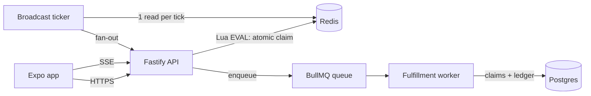

# Surge: Live Drop Demo Spec

> Working name: **Surge**. A fan-membership app feature that survives a traffic spike.
> Generic fan-club branding only. No real creator names, likenesses, or logos.

## 1. Why this exists

This is a portfolio demo for a Senior Full Stack Engineer application. It must prove three things in under five minutes of a reviewer's time:

1. **Ships end to end**: data model → API → polished mobile client, live and clickable.
2. **Thinks at consumer scale**: handles a burst of tens of thousands of users competing for limited inventory with zero oversells, and degrades gracefully past capacity.
3. **AI-native, two ways**: _built_ with an engineered Claude Code workflow (§17), and _building with_ AI inside the product (§11a).

Polish on a narrow feature beats breadth. If a choice comes down to "more features" or "the core flow is fast, correct, and beautiful", pick the second.

## 2. The story

A creator posts a new video. At that moment a **Live Drop** opens: a limited batch of brand-sponsored rewards (e.g. 10,000 exclusive items). Members:

1. See a countdown on their home screen, then a push-style banner when the drop opens.
2. Complete a quick challenge (one trivia question tied to the drop).
3. Tap **Claim**. Within a second they learn: claimed (with their position, "#4,812 of 10,000"), sold out, or already claimed.
4. Watch a live counter of remaining rewards and a points leaderboard update in real time.

Earlier claims earn more points. Points accumulate in an append-only ledger across drops.

A brand/admin user creates drops: title, sponsor, reward, quantity, start/end time, challenge.

## 3. Scope

**In**

- Expo (React Native) mobile app, also runnable on web via Expo
- Node/TypeScript API
- Postgres for durable records, Redis for the hot path
- Mock auth (dev login by handle → JWT)
- One drop type with one challenge type (multiple-choice question)
- Live counter + leaderboard over SSE
- Waiting room / backpressure past capacity
- k6 load tests, reconciliation script, one-page scale write-up
- Minimal admin for creating drops (first thing to cut if behind; fall back to a seed script)
- AI-assisted challenge drafting in the admin (§11a), off the hot path, human-approved

**Out**

- Real payments, real auth providers, real push notifications
- Multiple drop types, social features, chat
- Native builds / app store distribution (Expo Go + web is enough)

## 4. Architecture

```
apps/
  mobile/        Expo + expo-router, TypeScript
  api/           Node 20, Fastify, TypeScript
  admin/         Minimal web admin (optional; Vite + React)
packages/
  shared/        zod schemas + shared types (API contract)
load/            k6 scripts + results
scripts/         seed, reconcile, mint test tokens
docs/            SCALE.md (write-up), architecture diagram
.claude/         settings.json (hooks, permissions), hooks/, agents/, skills/
.github/         CI + Claude PR review
CLAUDE.md  SPEC.md  BUILD_LOG.md  .mcp.json
docker-compose.yml   postgres + redis for local dev
```



### Key design decision: Redis is authoritative during the live window

- During a drop, **inventory and claim state live in Redis**, mutated only by one atomic Lua script. This keeps the claim path to a single round trip with no row locks under contention.
- Every successful claim is **enqueued** and written to Postgres by a worker (claim row + ledger entry). Postgres unique constraints are the backstop against duplicates.
- Redis runs with AOF persistence. After a drop closes, `scripts/reconcile.ts` verifies Redis and Postgres agree (claim count, no duplicates, remaining = total − claims).
- This trade-off (durability vs. hot-path latency) is deliberate and must be explained in `docs/SCALE.md`. It is a great interview talking point.

## 5. Data model (Postgres)

| Table           | Columns                                                                                                                                                                | Notes                                                                                                            |
| --------------- | ---------------------------------------------------------------------------------------------------------------------------------------------------------------------- | ---------------------------------------------------------------------------------------------------------------- |
| `members`       | `id uuid pk`, `handle text unique`, `tier text`, `created_at`                                                                                                          | tier: `free` / `plus`                                                                                            |
| `drops`         | `id uuid pk`, `title`, `sponsor`, `reward_name`, `reward_image_url`, `total_qty int`, `starts_at`, `ends_at`, `challenge jsonb`, `challenge_source text`, `created_at` | challenge: `{question, options[], answer_index}` (answer never sent to clients); source: `human` / `ai_assisted` |
| `claims`        | `id uuid pk`, `drop_id fk`, `member_id fk`, `position int`, `idempotency_key text`, `created_at`                                                                       | `unique(drop_id, member_id)`, `unique(idempotency_key)`                                                          |
| `points_ledger` | `id bigserial pk`, `member_id fk`, `delta int`, `reason text`, `ref_id uuid`, `created_at`                                                                             | append-only; balance = `sum(delta)`; `unique(reason, ref_id)` prevents double-award                              |

## 6. Redis keys

| Key                     | Type             | Purpose                                               |
| ----------------------- | ---------------- | ----------------------------------------------------- |
| `drop:{id}:meta`        | hash             | total, starts_at, ends_at (loaded when drop is armed) |
| `drop:{id}:remaining`   | int              | inventory counter                                     |
| `drop:{id}:claimed`     | set              | member ids who claimed                                |
| `drop:{id}:lb`          | zset             | leaderboard for the drop (points)                     |
| `lb:global`             | zset             | all-time points leaderboard                           |
| `idem:{key}`            | string (TTL 24h) | cached claim response for idempotent retries          |
| `admit:{drop}:{second}` | int (TTL 5s)     | admission counter for the waiting room                |

## 7. Claim algorithm (single Lua script)

Inputs: drop id, member id, now, idempotency key.

1. If `idem:{key}` exists → return the cached result.
2. If now < starts_at → `NOT_OPEN`. If now > ends_at → `CLOSED`.
3. If member ∈ `claimed` → `ALREADY_CLAIMED`.
4. If `remaining` ≤ 0 → `SOLD_OUT`.
5. `DECR remaining`, `SADD claimed member`, position = total − remaining.
6. Points = earlier is better (e.g. `max(10, 100 − floor(position / (total/90)))`). `ZINCRBY` drop and global leaderboards.
7. Cache result under `idem:{key}`; return `CLAIMED {position, points}`.

Then, outside the script: enqueue a fulfillment job `{dropId, memberId, position, points, idempotencyKey}`.

The challenge answer is validated **before** the Lua script (wrong answer → 422, no inventory touched).

## 8. Backpressure and waiting room

- Admission control in front of `/claim`: per-second admission counter in Redis (`admit:{drop}:{second}`) capped at a configurable `MAX_ADMITS_PER_SEC`.
- Over the cap → `429` with `Retry-After` (ms) and an estimated wait. The client shows a **waiting room** screen and retries with **jittered exponential backoff**. It never hammers.
- Per-member rate limit (e.g. 5 claim attempts / 10s) to stop tap-spam and scripted abuse.
- Goal under overload: **zero 5xx**, only clean 429s, and the counter/leaderboard stay live.

## 9. Real-time updates

- `GET /drops/:id/stream` (SSE).
- A **single broadcast ticker per API instance** reads `remaining` + top 10 from Redis every 500ms and fans out to all connected clients. Reads per tick are O(1) regardless of client count. Call this out in the write-up.
- Mobile uses `react-native-sse` (RN has no native EventSource). Fall back to polling every 2s if the stream drops.

## 10. API

All request/response bodies validated with zod schemas from `packages/shared`.

| Method | Path                      | Notes                                                                                                                                                   |
| ------ | ------------------------- | ------------------------------------------------------------------------------------------------------------------------------------------------------- |
| POST   | `/auth/dev-login`         | `{handle}` → `{token, member}`; creates member if new                                                                                                   |
| GET    | `/me`                     | member + points balance + tier                                                                                                                          |
| GET    | `/drops/upcoming`         | next/current drops (no challenge answers)                                                                                                               |
| GET    | `/drops/:id`              | drop detail + challenge question/options                                                                                                                |
| POST   | `/drops/:id/claim`        | header `Idempotency-Key`; body `{answerIndex}` → `CLAIMED` / `SOLD_OUT` / `ALREADY_CLAIMED` / `NOT_OPEN` / `CLOSED`; 422 wrong answer; 429 waiting room |
| GET    | `/drops/:id/stream`       | SSE: `{remaining, total, top: [{handle, points}]}`                                                                                                      |
| GET    | `/leaderboard`            | global top 50 + caller's rank                                                                                                                           |
| POST   | `/admin/drops`            | create drop (admin token)                                                                                                                               |
| POST   | `/admin/drops/:id/arm`    | load drop into Redis                                                                                                                                    |
| POST   | `/admin/challenges/draft` | `{sponsor, reward, theme, audience}` → 3 validated challenge candidates (§11a)                                                                          |
| GET    | `/healthz`, `/metrics`    | health + basic counters                                                                                                                                 |

## 11. Mobile screens

1. **Login**: pick a handle (dev login).
2. **Home**: next drop card with live countdown, points balance, tier badge.
3. **Drop**: reward hero image, sponsor, countdown → challenge question → Claim button. Live remaining counter (animated).
4. **Claim result**: success (position + points, celebratory but tasteful animation), sold out, already claimed.
5. **Waiting room**: calm, honest ("Lots of fans right now, you're in line"), auto-retry with progress feel.
6. **Leaderboard**: drop + global tabs, highlight the user's row.

Every async state needs a designed loading, empty, and error state. Optimistic UI only where it can't lie (never optimistically show "claimed").

## 11a. AI-assisted challenge drafting

Brands and creators shouldn't have to write trivia by hand for every drop. In the admin, a sponsor enters reward, theme, and audience, and gets **three drafted challenge questions** to pick from and edit.

- `POST /admin/challenges/draft` calls the Claude API (model from `ANTHROPIC_MODEL` env var) with a system prompt that defines tone, difficulty (answerable by a casual fan in <10s), and safety rules (no real people, nothing that could embarrass a sponsor).
- **Structured output:** the model must return JSON matching a zod schema (`ChallengeDraft[]`: question ≤ 120 chars, exactly 4 options, `answer_index` 0–3, `rationale`). Invalid output → one retry with the validation errors fed back → otherwise a clear error and manual entry.
- **Server-side checks** after validation: options are unique, the answer isn't trivially the longest option, and no banned terms.
- **Human in the loop:** nothing AI-drafted goes live without an admin selecting it. Saved drops record `challenge_source = 'ai_assisted'`.
- **Never on the hot path.** Drafting happens at drop-creation time only. 10s timeout, no retries during a live drop, and the feature degrades to manual entry if the API is down.
- **Tests:** schema-validation unit tests using recorded fixtures (no live API calls in CI), plus one test for the invalid-then-retry path.
- **Write-up:** a short section in README on prompt design, validation, and why it's kept off the hot path.

## 12. Load testing (`load/`)

- `scripts/mint-tokens.ts` pre-creates N members and writes tokens to a file k6 reads.
- **spike.js**: `ramping-arrival-rate` from ~0 to peak in 10s, hold 30s, against a 10,000-unit drop with 50,000–100,000 users. Each VU: answer challenge, claim once with an idempotency key, retry on 429 per `Retry-After`, and ~5% deliberately double-submit the same key.
- **sse.js**: hold several thousand SSE connections open during the spike.
- Record: p50/p95/p99 latency for `/claim`, status-code breakdown, throughput, error rate.
- After every run: `scripts/reconcile.ts` must report **0 oversells, 0 duplicate claims, Redis = Postgres**.
- Run at least twice: **before and after** fixing the first bottleneck found. Save both results in `load/results/`.
- State the environment honestly in the write-up (instance sizes, single load generator, etc.).

## 13. Deployment

- API + worker: Railway or Fly.io (two processes, same image).
- Postgres: Supabase.
- Redis: a dedicated instance close to the API (Railway/Fly Redis). Avoid per-request-priced serverless Redis for load tests, because request caps will distort results.
- Mobile: Expo Go link + Expo web build hosted alongside the API.

## 14. Deliverables

- [ ] Public GitHub repo with README (what, why, quick start <5 min, architecture diagram)
- [ ] Live demo link (Expo Go + web)
- [ ] `docs/SCALE.md`: one page with design, trade-offs, load results (graphs), bottleneck found and fixed
- [ ] `BUILD_LOG.md`: running totals, per-session entries, guardrail catches (§17)
- [ ] README section **"How this was built"**: the `.claude/` setup, the hooks and why they exist, the worktree parallel session, one honest guardrail-catch story, and the AI challenge feature
- [ ] 2–3 minute walkthrough video: drop → claim → live counter → load test graphs

## 15. Acceptance criteria

- Concurrency test: 2,000 parallel claims against a 500-unit drop → exactly 500 `CLAIMED`, 0 duplicates.
- Same idempotency key submitted twice → identical response, one claim.
- Spike test past capacity → no 5xx; overflow returns 429 with `Retry-After`.
- Reconcile passes after every load run.
- Claim-to-result feels instant on a phone (<300ms p95 at demo load).
- No real creator branding anywhere.
- AI drafting: invalid model output is never saved; every AI-drafted challenge passed through human selection.
- Every merged PR has green CI and a Claude review comment.
- `main` history is linear, PR-only, and every commit on it passed `ci-ok`. Any claim-path PR shows a passing `claim-smoke` run with its k6 + reconcile artifact.

## 16. Schedule

| Day | Milestone                                                                                                                                                                                                                                                                                                                    |
| --- | ---------------------------------------------------------------------------------------------------------------------------------------------------------------------------------------------------------------------------------------------------------------------------------------------------------------------------- |
| Mon | M0: monorepo, docker-compose, shared schemas, DB migrations, seed, lefthook, the pnpm scripts CI depends on (`typecheck`, `lint`, `test`, `test:concurrency`, `build`, `start:api`, `start:worker`, `load:spike --quick`, `reconcile --latest --wait-for-drain`). Push, let CI run once, then run `scripts/protect-main.sh`. |
| Tue | M1: auth, drops, Lua claim, idempotency, queue + worker, SSE ticker, concurrency tests                                                                                                                                                                                                                                       |
| Wed | M2: run `scripts/worktrees.sh` and work two parallel lanes. **api lane:** hardening, admin endpoints, AI challenge drafting. **mobile lane:** Expo app (all screens and states), minimal admin UI                                                                                                                            |
| Thu | M3: deploy, k6 spike, find + fix bottleneck, waiting room, reconcile. **Feature freeze tonight.**                                                                                                                                                                                                                            |
| Fri | M4: README, SCALE.md, BUILD_LOG.md, video, apply                                                                                                                                                                                                                                                                             |

**Cut order if behind:** admin UI → AI drafting (keep the endpoint, drop the UI) → SSE leaderboard (keep counter) → web build → tier badges. Never cut: claim correctness, load test + write-up, BUILD_LOG.

## 17. AI-native engineering workflow

The repo itself demonstrates how the work was done. Reviewers should be able to see the workflow in the files, not just read a claim about it.

| Piece              | Where                                                                                      | Purpose                                                                                                                                                                                                                                                                                                                                                          |
| ------------------ | ------------------------------------------------------------------------------------------ | ---------------------------------------------------------------------------------------------------------------------------------------------------------------------------------------------------------------------------------------------------------------------------------------------------------------------------------------------------------------- |
| Project memory     | `CLAUDE.md`                                                                                | Rules the agent always follows: stack, conventions, claim-path rules, branding, scope                                                                                                                                                                                                                                                                            |
| Skills             | `.claude/skills/`                                                                          | `/milestone` (plan → tests first → build → review → log), `/claim-change` (required procedure for the riskiest code), `/load-run` (reproducible spike test + evidence), `/log-session`                                                                                                                                                                           |
| Reviewer subagents | `.claude/agents/`                                                                          | Specialists with their own context and no edit tools (the two with Bash use it only to run tests and read output): `concurrency-reviewer` (adversarial), `ui-states-reviewer`, `load-test-analyst`. Building and reviewing are deliberately separate.                                                                                                            |
| Hooks              | `.claude/settings.json`, `.claude/hooks/`                                                  | Deterministic guardrails: block edits to secrets/lockfile/applied migrations/results; typecheck + lint after every edit; concurrency suite after every claim-path edit. Enforced, not requested.                                                                                                                                                                 |
| Permissions        | `.claude/settings.json`                                                                    | Allow routine commands; deny reading `.env`, force push, `rm -rf`                                                                                                                                                                                                                                                                                                |
| MCP                | `.mcp.json`                                                                                | Read-only Postgres access (via `DATABASE_URL_READONLY`, a SELECT-only role) for debugging and reconciliation                                                                                                                                                                                                                                                     |
| Parallelism        | `scripts/worktrees.sh`                                                                     | Two Claude Code sessions in separate git worktrees, safe because of the shared zod contract                                                                                                                                                                                                                                                                      |
| Merge gates        | `lefthook.yml`, `.github/workflows/ci.yml`, `scripts/protect-main.sh`, `branch-guard` hook | Four layers: local hooks (commit/push) → CI (`verify` always; `claim-smoke` boots the real API, spikes it with k6, and reconciles whenever the claim path changes) → one required `ci-ok` check → GitHub ruleset (PR only, up to date, threads resolved, linear history, no force push). The agent can't commit to main, push to main, merge PRs, or skip hooks. |
| AI review          | `.github/workflows/claude-review.yml`                                                      | A Claude PR review focused on the claim-path invariants, hot-path additions, and missing tests                                                                                                                                                                                                                                                                   |
| Evidence           | `BUILD_LOG.md`, `load/results/`                                                            | Honest metrics, including bugs the agent introduced and which guardrail caught them                                                                                                                                                                                                                                                                              |

**Interview framing:** "I don't ask the agent to be careful. I make careless output impossible to merge. Hooks enforce, tests gate, a separate reviewer attacks, and the log keeps me honest about where it failed."
